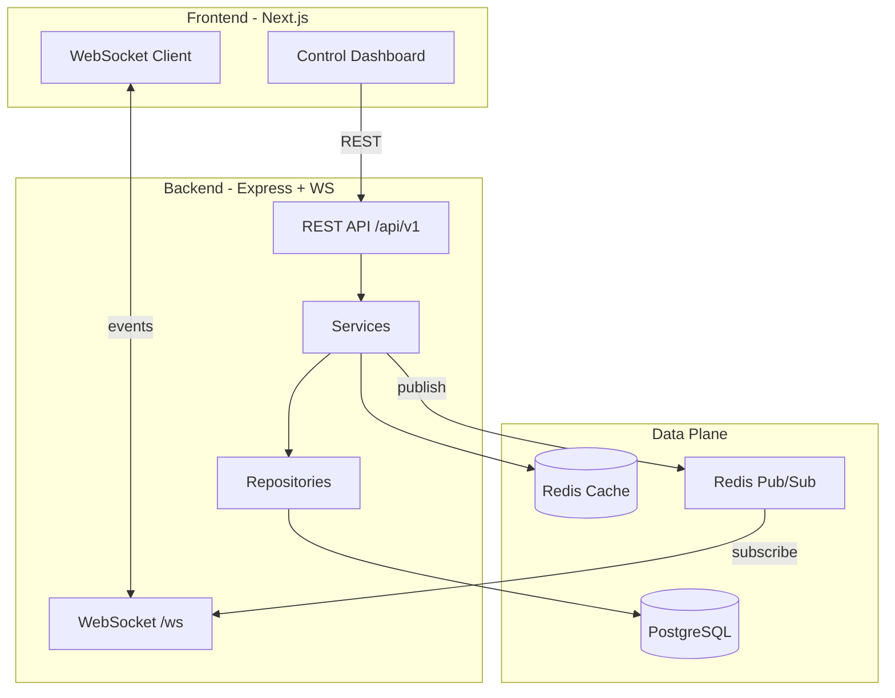
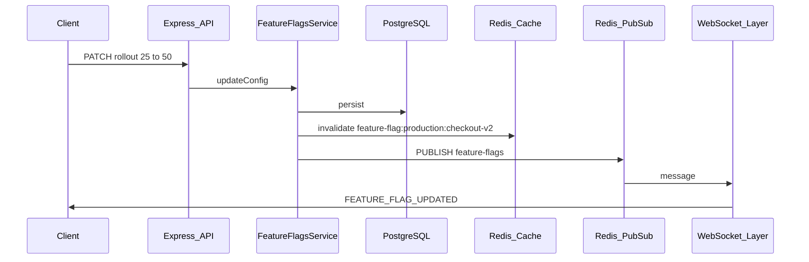
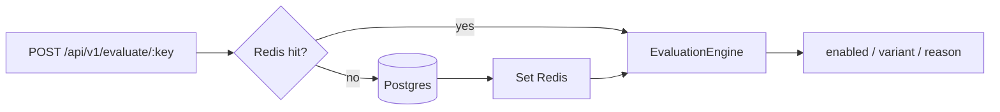

# SWITCHBOARD

**Real-Time Feature Release & Incident Control Platform**

SWITCHBOARD is a production-style portfolio project that demonstrates full-stack and system-design skills: feature flags, progressive rollouts, Redis caching + Pub/Sub, WebSockets, PostgreSQL, RBAC, audit logs, and incident management.

Operators control production features without redeploying. Example: change `checkout-v2` rollout from 25% → 50% in production; the update persists to PostgreSQL, invalidates Redis cache, publishes via Redis Pub/Sub, and fans out to connected dashboards over WebSockets in real time.

> **Current status:** Production-style portfolio build — auth/RBAC, feature flags, Redis cache + Pub/Sub, WebSockets, incidents, audit UI, `@switchboard/sdk`, and Folio demo. Deployed control plane + API.

---

## Architecture



### Mutation + realtime flow



### Layered backend

```text
Routes → Controllers → Services → Repositories → Prisma / PostgreSQL
```

Infrastructure (Redis, WebSocket, auth middleware) sits beside services — not inside controllers.

---

## Tech Stack

| Layer | Choices |
|-------|---------|
| Frontend | Next.js (App Router), TypeScript, Tailwind CSS, TanStack Query, WebSocket client |
| Backend | Node.js, Express.js, TypeScript (no NestJS) |
| Database | PostgreSQL + Prisma ORM |
| Realtime / cache | Redis (cache + Pub/Sub), `ws` WebSocket server |
| Auth | JWT + RBAC roles |
| Local infra | Docker Compose (Postgres 16 + Redis 7) |

---

## Folder Structure

```text
.
├── frontend/                 # Next.js control plane
│   ├── app/                  # App Router pages
│   ├── components/           # Layout, UI, realtime
│   ├── features/             # Feature-scoped UI modules
│   ├── hooks/
│   ├── lib/
│   ├── services/
│   └── types/
├── backend/
│   ├── prisma/               # schema.prisma + seed
│   └── src/
│       ├── config/
│       ├── controllers/
│       ├── routes/
│       ├── services/         # business logic + evaluation engine
│       ├── repositories/
│       ├── middleware/
│       ├── websocket/
│       ├── redis/
│       ├── database/
│       ├── utils/
│       ├── app.ts
│       └── server.ts
├── docker-compose.yml
├── package.json              # npm workspaces
└── README.md
```

---

## Local Development Setup

### Prerequisites

- Node.js 20+
- Docker + Docker Compose
- npm 10+

### 1. Start infrastructure

```bash
docker compose up -d
```

This starts PostgreSQL (`localhost:5432`) and Redis (`localhost:6379`).

### 2. Environment files

```bash
cp .env.example .env
cp backend/.env.example backend/.env
cp frontend/.env.example frontend/.env.local
```

### 3. Install dependencies

```bash
npm install
```

### 4. Prisma generate & seed

```bash
npm run prisma:generate
# npm run prisma:push   # apply schema
# npm run prisma:seed   # demo data
```

### 5. Run apps

```bash
# Terminal A
npm run dev:backend

# Terminal B
npm run dev:frontend
```

- Frontend: http://localhost:3000  
- Backend API: http://localhost:4000/api/v1  
- Health: http://localhost:4000/api/v1/health  
- WebSocket: `ws://localhost:4000/ws`

---

## Environment Variables

| Variable | Where | Purpose |
|----------|--------|---------|
| `DATABASE_URL` | backend | Prisma → PostgreSQL |
| `REDIS_URL` | backend | Cache + Pub/Sub |
| `JWT_SECRET` | backend | JWT signing |
| `JWT_EXPIRES_IN` | backend | Token TTL |
| `CORS_ORIGIN` | backend | Allowed frontend origin |
| `PORT` | backend | HTTP/WS port (default `4000`) |
| `NEXT_PUBLIC_API_URL` | frontend | REST base URL |
| `NEXT_PUBLIC_WS_URL` | frontend | WebSocket URL |

Never commit real secrets. Use `.env.example` templates only.

---

## Database Setup

Prisma schema: [`backend/prisma/schema.prisma`](backend/prisma/schema.prisma)

### Core models

- **User** — `Role` enum: `ADMIN` | `RELEASE_MANAGER` | `DEVELOPER` | `VIEWER`
- **Environment** — `development` / `staging` / `production`
- **FeatureFlag** — logical flag (`key`, `name`, …)
- **FeatureFlagConfig** — per-environment `enabled`, `rolloutPercentage`, `killed`, `killReason`
- **TargetingRule** — `USER_ID` | `REGION` rules on a config
- **Incident** + **IncidentAffectedFlag** + **IncidentEvent** (timeline)
- **AuditLog** — append-only cross-entity trail

Flags are split into definition + per-environment config so `checkout-v2` can be 100% in staging and 25% in production.

---

## Redis Setup

| Usage | Key / channel | Why |
|-------|---------------|-----|
| Flag cache | `feature-flag:{env}:{key}` | Low-latency evaluation reads |
| Pub/Sub | `feature-flags` | Flag mutation fanout |
| Pub/Sub | `incidents` | Incident mutation fanout |
| Pub/Sub | `system-events` | System / health notices |
| Rate limiting | In-memory on `/evaluate` | Sufficient for demo; Redis limiter optional |

Writes always invalidate/update cache and **publish through Redis Pub/Sub** (even on a single instance) so horizontal scaling stays correct.

---

## SDK + Folio demo

External apps integrate through `@switchboard/sdk` (not the operator JWT).

```ts
import { SwitchboardClient } from '@switchboard/sdk';

const sb = new SwitchboardClient({
  apiUrl: 'http://localhost:4000',
  apiKey: process.env.SWITCHBOARD_API_KEY!,
  environment: 'production',
});

if (await sb.isEnabled('folio-hero-v2', { userId: 'reader-ava' })) {
  // show new hero
}
```

Demo consumer app: **Folio** (magazine reader) on port `3001`.

```bash
npm run build:sdk
npm run dev:demo
```

Seeded demo API key: `sb_live_folio_demo_key_local_only_0001`  
Flags: `folio-hero-v2`, `folio-audio-mode`, `folio-member-gate`  
Manage keys in Switchboard → Settings (ADMIN).

CORS must allow both control plane and demo:

`CORS_ORIGIN=http://localhost:3000,http://localhost:3001`

---

## How Real-Time Updates Work

1. Client mutates state via REST (authorized).
2. Service persists to PostgreSQL (source of truth).
3. Service updates/invalidates Redis cache.
4. Service publishes a typed event to a Redis channel.
5. Backend subscriber receives the message.
6. WebSocket layer broadcasts to connected dashboards.
7. Frontend `useWebSocket` + LIVE indicator update UI without refresh.

Event envelope:

```json
{
  "type": "FEATURE_FLAG_UPDATED",
  "channel": "feature-flags",
  "payload": {
    "flagKey": "checkout-v2",
    "environment": "production",
    "rolloutPercentage": 50
  },
  "timestamp": "2026-08-09T08:00:00.000Z"
}
```

---

## Feature Flag Evaluation Flow



- Evaluation is **deterministic** (SHA-256 bucket 0–99). No `Math.random()`.
- Order of precedence (planned): kill switch → disabled → user targeting → region targeting → global rollout.
- Engine lives in [`backend/src/services/evaluation-engine.service.ts`](backend/src/services/evaluation-engine.service.ts).

Example response shape:

```json
{
  "key": "checkout-v2",
  "enabled": true,
  "variant": "on",
  "reason": "ROLLOUT"
}
```

---

## REST API Modules

| Module | Base path |
|--------|-----------|
| Auth | `/api/v1/auth` |
| Users | `/api/v1/users` |
| Environments | `/api/v1/environments` |
| Feature Flags | `/api/v1/feature-flags` |
| Evaluate | `/api/v1/evaluate` |
| API Keys | `/api/v1/api-keys` |
| Incidents | `/api/v1/incidents` |
| Audit Logs | `/api/v1/audit-logs` |
| Health | `/api/v1/health` |

Controllers are thin; services own business rules; repositories own Prisma access.

---

## Frontend Routes

| Route | Purpose |
|-------|---------|
| `/login` | Auth |
| `/dashboard` | Control plane overview + LIVE indicator |
| `/feature-flags` | Flag list |
| `/feature-flags/[flagKey]` | Flag detail, rollout viz, kill switch |
| `/incidents` | Incident list |
| `/incidents/[incidentId]` | Timeline + emergency actions |
| `/audit-logs` | Append-only audit trail |
| `/environments` | Env management |
| `/settings` | Operator settings |

> **Security:** The public login page may expose a **VIEWER** demo account only (read-only). Never publish ADMIN / RELEASE_MANAGER passwords on the UI or in the README.

---

## Roadmap (completed → optional next)

| Area | Status |
|------|--------|
| Scaffold / monorepo / Docker | Done |
| Auth + RBAC | Done |
| Feature flags + targeting + evaluate | Done |
| Redis cache + Pub/Sub + WebSockets | Done |
| Incidents + kill switch | Done |
| Audit UI + SDK + Folio demo | Done |
| Deploy (Vercel + Render + Neon + Upstash) | Done |
| WS JWT auth, deeper observability | Optional |

---

## Design Principles

- TypeScript strict mode
- Modular Express (no NestJS, no giant `server.js`)
- Separation of concerns: routes / controllers / services / repositories
- Thin controllers; business logic in services
- No hardcoded secrets
- Centralized error handling + request IDs
- Append-only audit logs from the application perspective
- Deterministic flag evaluation

---

## License

Private portfolio project — all rights reserved.
